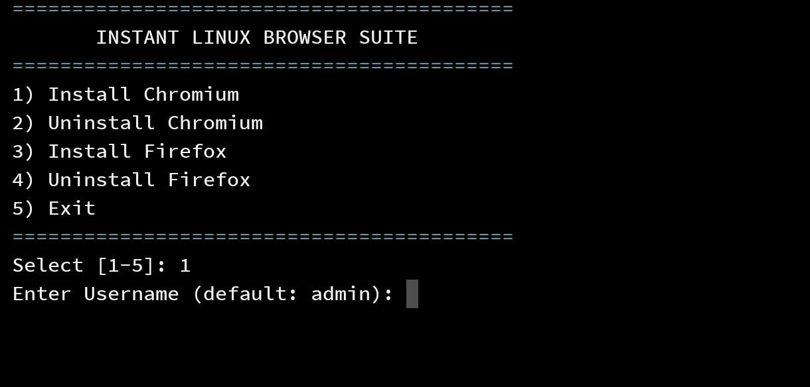

# Instant Linux Browser

A Bash script that deploys web-accessible browsers (Chromium and Firefox) on a Linux server using Docker.  
Useful when you want remote browser access from a phone or laptop while managing a server via SSH.

## Features
- Interactive install/uninstall menu
- Optional username/password for the web UI
- Quick setup (single command)

<p align="center">
  
</p>

---

## Quick Installation

Run this on an Ubuntu/Debian server:

```bash
bash <(curl -fsSL https://raw.githubusercontent.com/Mammad3861/Instant-Linux-Browser/main/browser.sh)```

## Available Options
Install Chromium (port 3000)
Install Firefox (port 4000)
Uninstall (removes containers and related files)
## Security Notes
If you expose the service to the internet:
Use a strong password (12+ characters).
Put it behind a reverse proxy (Nginx/Traefik) and enable HTTPS.
Restrict access with a firewall (UFW/IPTables) and/or IP allow-listing.
## Advanced Configuration
The script sets some defaults to improve stability:
PUID/PGID set to 1000 (permissions)
--shm-size set to 1g (helps prevent browser tab crashes)
seccomp settings to support browser sandboxing in Docker
Troubleshooting
If you see “Connection refused”:
Make sure ports 3000 / 4000 are open in your firewall/security group.
Check Docker:
```Bash
sudo systemctl status docker```
Check container logs:
```Bash
docker logs chromium
docker logs firefox```
## Known Issues
Browser SSL warning: If you use a self-signed certificate, the browser may show a warning.
Chromium on ARM: Some ARM kernels may restrict sandboxing and cause a black screen. Firefox is usually the safer option.
## License
MIT
