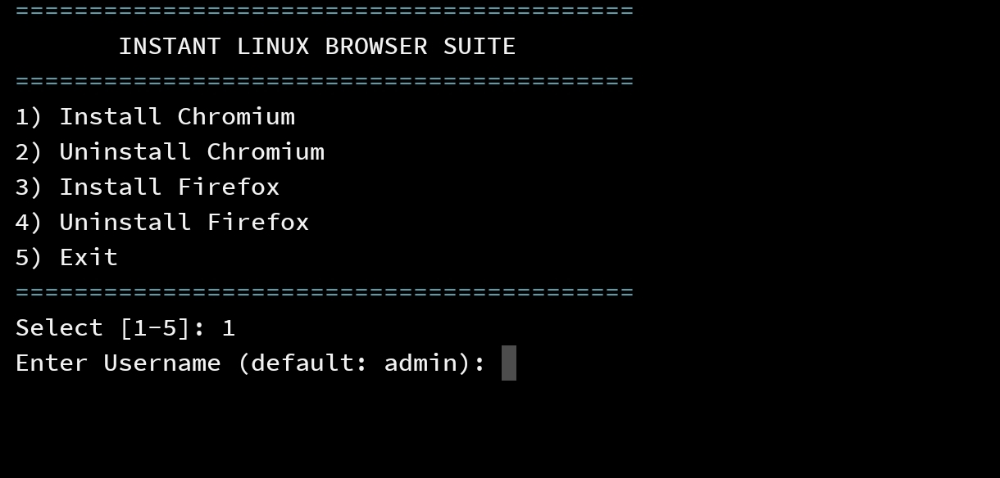

# 🌐 Instant Linux Browser

A lightweight Bash script to deploy web-accessible browsers (Chromium & Firefox) on any Linux server using Docker.  
Perfect for accessing a full desktop browser remotely via your phone or laptop while managing servers over SSH.

## ✨ Features
- ✅ **Interactive Menu:** Easy install/uninstall management.
- 🔒 **Security:** Optional password protection for the Web UI.
- ⚡ **Lightweight:** Optimized container settings for low resource usage.
- 🚀 **One-Command Setup:** Get up and running in seconds.
<p align="center">
  
</p>
---

## 🚀 Quick Installation

Run this command on your Ubuntu/Debian server:

```bash
curl -fsSL [https://raw.githubusercontent.com/Mammad3861/Instant-Linux-Browser/main/browser.sh](https://raw.githubusercontent.com/Mammad3861/Instant-Linux-Browser/main/browser.sh) | bash
```

## 🛠 Available Options

  Install Chromium: Accessible on port 3000

  Install Firefox: Accessible on port 4000

  Uninstall: Completely removes containers and clean up files.

## 🔒 Security Recommendations

If exposing this service to the public internet:

  Strong Passwords: Use at least 12+ characters.

  Reverse Proxy: Use Nginx or Traefik with HTTPS (SSL).

  Firewall: Restrict access using UFW or IP allow-listing.

## ⚙️ Advanced Configuration

The script applies these optimizations by default:

  PUID/PGID: Set to 1000 for consistent permissions.

  Shared Memory: --shm-size set to 1gb to prevent browser crashes.

  Sandboxing: Seccomp profiles enabled for enhanced security.

## 🔍 Troubleshooting

  Connection Refused? Ensure ports 3000/4000 are open in your cloud provider's firewall.

  Check Status: ```sudo docker ps```

  View Logs: ```docker logs chromium``` or ```docker logs firefox```

## ⚠️ Known Issues

  SSL Warning: If you use a self-signed certificate, the browser may show a warning.

  Chromium Black Screen (ARM/AMD): Some kernels restrict sandboxing and cause a black screen. Firefox is usually the safer option. If you still prefer Chromium and get a black screen, run this command manually on your server to force it to start:

```Bash
docker exec -it chromium bash -c "DISPLAY=:1 chromium-browser --no-sandbox"
```

## 📄 License

MIT
